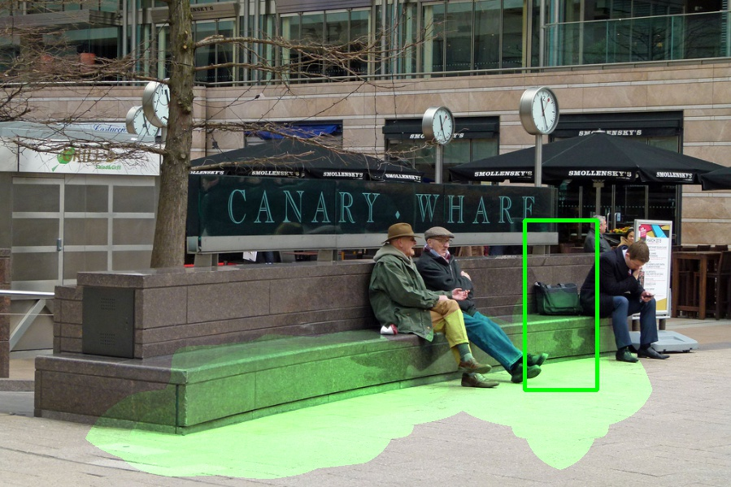

# [Where and Who? Automatic Semantic-Aware Person Composition](https://arxiv.org/abs/1706.01021)
Fuwen Tan, Crispin Bernier, Benjamin Cohen, Vicente Ordonez, Connelly Barnes, WACV 2018.


## Overview
Image compositing is a method used to generate realistic yet fake imagery by inserting contents from one image to another. Previous work in compositing has focused on improving appearance compatibility of a user selected foreground segment and a background image (i.e. color and illumination consistency). In this work, we instead develop a fully automated compositing model that additionally learns to select and transform compatible foreground segments from a large collection given only an input image background. To simplify the task, we restrict our problem by focusing on human instance composition, because human segments exhibit strong correlations with their background and because of the availability of large annotated data. We develop a novel branching Convolutional Neural Network (CNN) that jointly predicts candidate person locations given a background image. We then use pre-trained deep feature representations to retrieve person instances from a large segment database. Experimental results show that our model can generate composite images that look visually convincing. 

## Software required
 - Python 2.7
 - Tensorflow (1.4.1 or above)
 - Keras (2.0.8 or above)

## Installation for the demo

1. Clone the repository
  ```Shell
  git clone https://github.com/fwtan/who_where.git
  ```
  We'll call the directory that you cloned the repo into `COMP_ROOT`


2. Compile the Cython and pycocotools modules
    ```Shell
    cd $COMP_ROOT/lib
    make
    ```

3. Download the auxiliary data, pretrained model and example inputs
    ```Shell
    cd $COMP_ROOT/tools
    ./fetch_data.sh
    ```
    This will populate the `$COMP_ROOT/data` folder with `coco`, `pretrained`, and `testset`. 


4. Download the COCO 2014 validation set and the annotations if you have not done so
    ```Shell
    cd $COMP_ROOT/tools
    ./fetch_coco.sh
    ```
    This will populate the `$COMP_ROOT/data` folder with `coco/images` and `coco/annotations`. 
    The COCO validation data is used to help build candidate pool for segment retrieval.


## Demo

After the installation, you should be able to run the demo.
To run the demo
```Shell
cd $COMP_ROOT/tools
python demo.py
```
You can find the output images within $COMP_ROOT/output/composite_colors

## Example outputs
Here the first row shows the input images; 
The second row shows the heatmaps of the bounding box prediction, in which the green boxes indicate the top-1 predictions;
The third row shows the composite outputs.

    

    

    


## Citing

If you find our paper/code useful, please consider citing:

	@article{tan2018,
        title={Where and Who? Automatic Semantic-Aware Person Composition},
        author={Tan, Fuwen and Bernier, Crispin and Cohen, Benjamin and Ordonez, Vicente and Barnes, Connelly},
        booktitle={IEEE Winter Conf. on Applications of Computer Vision (WACV)},
        year={2018}
    }


